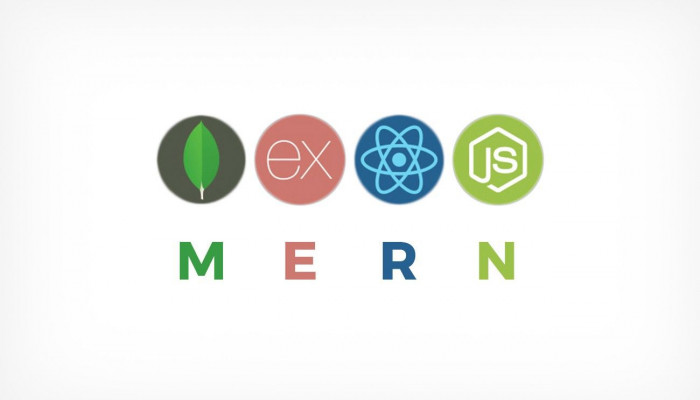

  

<h1 align="center">Hello,I'm Gokulakrishnan 👋</h1>
<h3 align="center">MERN Stack Dev Proudly Representing Tamil Nadu, India</h3>

  
🌱 I’m currently learning MERN STACK Development

  
Certified from GUVI, IITM Research park, Chennai, TN

  
💬 Ask me about HTML, JavaScript, CSS, React, NodeJS, ExpressJS

  
📫 How to reach me: [gokulakrishnan.m96@gmail.com](mailto:gokulakrishnan.m96@gmail.com)

  

<h3 align="center">Connect with me:</h3>

  

<h3 align="center">Skills:</h3>

  
  
  
  
  
  
  
  
  
  
  
  
  

  

  

  

